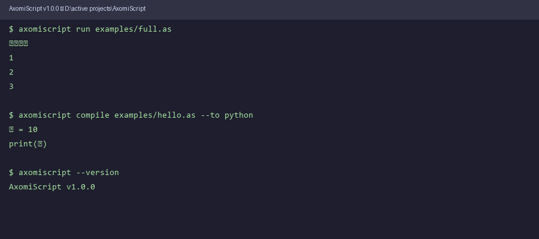

# AxomiScript (অসমী-স্ক্ৰিপ্ট)

**An open-source programming language you write in Assamese — compiles to Python 3 and C++17, with a built-in web IDE.**

[](tests/)
[](https://python.org)
[](LICENSE)
[](https://github.com/leonkaushikdeka/AxomiScript/actions)
[](docs/adding_a_language.md)

---

## Demo



---

## What is AxomiScript?

AxomiScript lets you **write real programs in Assamese** (অসমীয়া).
Use Assamese keywords, Eastern Nagari numerals (০১২…), and Assamese variable names.
The tool compiles your code to **Python 3** or **C++17**, and runs it immediately.

Error messages are shown in **both English and Assamese** — no need to know English to debug.

---

## Quick look

Write this in `program.as`:

```
চলক ক = ১০
যদি ক > ৫ {
    মুদ্ৰণ "ডাঙৰ"
}
নহলে {
    মুদ্ৰণ "সৰু"
}
চক্ৰ ই = ১ লৈ ৩ {
    মুদ্ৰণ ই
}
```

Run it:

```bash
axomiscript run program.as
```

```
ডাঙৰ
1
2
3
```

The same source compiles to **Python 3**:

```python
ক = 10
if (ক > 5):
    print("ডাঙৰ")
else:
    print("সৰু")
for ই in range(1, 3 + 1):
    print(ই)
```

And to **C++17**:

```cpp
#include <iostream>
#include <string>

int main() {
    int ক = 10;
    if ((ক > 5)) {
        std::cout << u8"ডাঙৰ" << std::endl;
    } else {
        std::cout << u8"সৰু" << std::endl;
    }
    for (int ই = 1; ই <= 3; ++ই) {
        std::cout << ই << std::endl;
    }
    return 0;
}
```

---

## Features

| Feature | Description |
|---------|-------------|
| **Write in Assamese** | Keywords, variable names, and numerals in Assamese script |
| **Run directly** | `axomiscript run file.as` — transpile + execute in one step |
| **Compile to Python 3** | Unicode identifiers preserved (PEP 3131) |
| **Compile to C++17** | UTF-8 strings, heuristic type inference (`int`/`double`/`std::string`) |
| **Web IDE** | Browser-based editor with Output / Python / C++ / AST tabs |
| **REPL** | Interactive session — try code line by line |
| **Bilingual errors** | Syntax errors shown in English + Assamese |
| **Community languages** | Add Hindi, Bengali, Bodo… in ~6 small files |

---

## Installation

**Requires:** Python 3.8 or newer

```bash
# From source
git clone https://github.com/leonkaushikdeka/AxomiScript.git
cd AxomiScript
pip install -e .

# With the web IDE (Flask)
pip install -e ".[web]"
```

---

## Usage

### Run a program

```bash
axomiscript run examples/full.as
```

### Compile to Python

```bash
axomiscript compile examples/full.as --to python
axomiscript compile examples/full.as --to python -o output.py
```

### Compile to C++

```bash
axomiscript compile examples/full.as --to cpp
axomiscript compile examples/full.as --to cpp   -o output.cpp
```

### Check syntax

```bash
axomiscript check examples/full.as          # Syntax OK / error message
axomiscript check examples/full.as --ast    # also print the AST (JSON)
```

### Interactive REPL

```bash
axomiscript repl
```

```
AxomiScript REPL  (language: assamese)
Type code and press Enter twice to run. Ctrl+C or 'exit' to quit.
──────────────────────────────────────────────────
>>> চলক ক = ৫
>>> মুদ্ৰণ ক
5
```

### Web IDE

```bash
pip install axomiscript[web]
axomiscript serve              # opens on http://localhost:5000
axomiscript serve --port 8080
```

The IDE gives you a split-pane view:

- **Left** — Assamese code editor (Tab = 4-space indent, Ctrl+Enter = run)
- **Right** — four tabs: **Output** · **Python** · **C++17** · **AST**
- **Status bar** — current language, line count, last run result

### Python API

```python
from axomiscript import compile_source, run_source

# Compile to Python
py = compile_source("চলক ক = ১০\nমুদ্ৰণ ক\n")
print(py)
# ক = 10
# print(ক)

# Compile to C++
cpp = compile_source("চলক ক = ১০\nমুদ্ৰণ ক\n", target="cpp")

# Run and capture output
result = run_source("চক্ৰ ই = ১ লৈ ৩ {\n    মুদ্ৰণ ই\n}\n")
print(result["stdout"])    # 1\n2\n3\n
print(result["exit_code"]) # 0

# Bilingual error messages
from axomiscript import explain_error
msg = explain_error("SYNTAX_ERROR", "unexpected {")
print(msg["en"])  # Syntax Error: unexpected {
print(msg["as"])  # ব্যাকৰণ সমস্যা — কোডৰ গঠনত ত্রুটি আছে
```

---

## Language Reference

### Keywords

| Role | Assamese | Notes |
|------|----------|-------|
| Variable declaration | `চলক` | `চলক নাম = মান` |
| If | `যদি` | `যদি চৰ্ত { ... }` |
| Else | `নহলে` | `নহলে { ... }` |
| Loop | `চক্ৰ` | counted for-loop |
| Print | `মুদ্ৰণ` | prints to stdout |
| Range end | `লৈ` | `চক্ৰ ই = ১ লৈ ৫ { ... }` |

### Numerals

Eastern Nagari numerals are accepted anywhere — they are converted to ASCII before parsing:

```
০ ১ ২ ৩ ৪ ৫ ৬ ৭ ৮ ৯   →   0 1 2 3 4 5 6 7 8 9
```

### Operators

| Type | Operators |
|------|-----------|
| Arithmetic | `+`  `-`  `*`  `/` |
| Comparison | `==`  `!=`  `>`  `<`  `>=`  `<=` |

### Syntax examples

```
# Variable assignment
চলক নাম = "অসম"
চলক সংখ্যা = ৪২
চলক দশমিক = 3.14

# If / else
যদি সংখ্যা > ১০ {
    মুদ্ৰণ "ডাঙৰ"
}
নহলে {
    মুদ্ৰণ "সৰু"
}

# Loop — 1 to 5 inclusive
চক্ৰ ই = ১ লৈ ৫ {
    মুদ্ৰণ ই
}

# Arithmetic
চলক ফল = (৩ + ৪) * ২
মুদ্ৰণ ফল
```

### Error messages (bilingual)

When your code has a syntax error, AxomiScript shows it in both languages:

```
Line 2: Unexpected token
লাইন 2: অপেক্ষা নকৰা চিহ্ন — এই চিহ্নটো এই ঠাইত নাছিল

  মুদ্ৰণ ক @@@
```

---

## Project Structure

```
AxomiScript/
├── axomiscript/
│   ├── compiler.py            # compile_source() — main API
│   ├── executor.py            # run_source()     — transpile + execute
│   ├── explainer.py           # bilingual error messages (no external deps)
│   ├── pipeline.py            # run() + CompilationError
│   ├── cli.py                 # CLI: compile / run / check / repl / serve
│   ├── core/
│   │   ├── ast_nodes.py       # Language-agnostic AST dataclasses
│   │   └── utils.py           # ast_to_dict, pretty_ast
│   ├── generators/
│   │   ├── python_gen.py      # AST → Python 3
│   │   └── cpp_gen.py         # AST → C++17
│   ├── languages/
│   │   ├── __init__.py        # Plugin registry (register / get_parser / available)
│   │   └── assamese/          # Reference language implementation
│   │       ├── keywords.py    # চলক / যদি / নহলে / চক্ৰ / মুদ্ৰণ / লৈ
│   │       ├── preprocessor.py# Nagari → ASCII numerals
│   │       ├── grammar.py     # Lark Earley grammar
│   │       ├── transformer.py # CST → AST
│   │       └── parser.py      # public parse(source) → Program
│   └── web/
│       ├── app.py             # Flask web IDE factory
│       └── templates/
│           └── index.html     # Single-page browser IDE
├── examples/
│   ├── hello.as
│   ├── if_else.as
│   ├── loop.as
│   └── full.as
├── tests/
│   └── test_assamese.py       # 24 tests (preprocessor, parser, generators, executor)
├── docs/
│   └── adding_a_language.md   # Step-by-step guide for new languages
├── pyproject.toml
├── requirements.txt
├── CONTRIBUTING.md
└── LICENSE  (MIT)
```

---

## Adding a New Language

This is the core community feature. Any language that can be described with 6 keywords can be added as a plugin in about 30 minutes.

### Supported languages

| Language | Status | Keywords file |
|----------|--------|---------------|
| Assamese (অসমীয়া) | ✅ Stable | `languages/assamese/keywords.py` |
| Hindi (हिन्दी) | 🔜 PRs welcome | [guide](docs/adding_a_language.md) |
| Bengali (বাংলা) | 🔜 PRs welcome | [guide](docs/adding_a_language.md) |
| Bodo (बड़ो) | 🔜 PRs welcome | [guide](docs/adding_a_language.md) |
| Odia, Tamil, Telugu… | 🔜 PRs welcome | [guide](docs/adding_a_language.md) |

### How it works (short version)

Each language frontend is one package under `axomiscript/languages/<name>/`. It only needs:

1. **`keywords.py`** — 6 keyword mappings

```python
# Example: Hindi
KEYWORDS = {
    "VAR":   "चर",
    "IF":    "अगर",
    "ELSE":  "नहीं_तो",
    "LOOP":  "चक्र",
    "PRINT": "प्रिंट",
    "TO":    "तक",
}
```

2. **`preprocessor.py`** — digit normalisation (if your script uses non-ASCII numerals)
3. **`grammar.py`** — reuse `_GRAMMAR_BASE`, inject your keywords
4. **`transformer.py`** — usually identical to the Assamese one
5. **`parser.py`** — wire it together
6. **`__init__.py`** — expose `parse`

Then add one line to `axomiscript/languages/__init__.py`:

```python
from .hindi import parse as _hindi_parse
register("hindi", _hindi_parse)
```

Full walkthrough with Hindi and Bodo examples: **[docs/adding_a_language.md](docs/adding_a_language.md)**

---

## Development

```bash
git clone https://github.com/leonkaushikdeka/AxomiScript.git
cd AxomiScript
pip install -e ".[dev]"

# Run tests
pytest

# Lint
ruff check axomiscript/
```

---

## Architecture

```
Source code (অসমীয়া)
       ↓
  [Preprocessor]   Nagari digits → ASCII
       ↓
  [Lark Lexer]     Unicode-aware tokeniser
       ↓
  [Earley Parser]  Context-free grammar → CST
       ↓
  [Transformer]    CST → typed Python dataclass AST
       ↓
  [Generators]     AST → Python 3  /  AST → C++17
       ↓
  [Executor]       Python subprocess → stdout/stderr
```

The AST nodes (`Program`, `VarDecl`, `IfStmt`, `LoopStmt`, `BinOp`, …) are **language-agnostic** — all language frontends compile to the same nodes, and all generators read the same nodes. Adding a new source language or a new target language is independent of everything else.

---

## Contributing

All contributions are welcome:

- 🌐 **New language frontends** (Hindi, Bengali, Bodo, Meitei, Odia…)
- 🐛 **Bug fixes** and better error messages
- ✨ **New language features** (functions, lists, string interpolation…)
- 📖 **Documentation** improvements
- 🎨 **Web IDE** enhancements

Please read **[CONTRIBUTING.md](CONTRIBUTING.md)** before opening a pull request.

---

## License

MIT License — see [LICENSE](LICENSE) for details.

Copyright (c) 2026 AxomiScript Contributors
